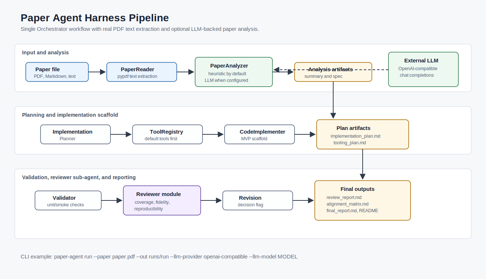

# Paper Agent Harness

AI 논문을 입력받아 구현 목표를 정리하고, 구현 계획, 도구/스킬 계획, 검증 결과, 리뷰 보고서, 최종 보고서를 생성하는 Codex 기반 Agent Harness MVP입니다.

현재 버전은 CLI로 실행하지만, 내부 실행 엔진은 LangGraph `StateGraph`입니다. CLI는 사용자 진입점으로 유지하고, 실제 단계 제어는 `src/paper_agent/graph.py`의 graph가 담당합니다.

## 주요 기능

- PDF, Markdown, plain text 논문 입력 경로를 받습니다.
- PDF는 `pypdf`로 실제 텍스트를 추출합니다. 스캔 이미지형 PDF는 향후 OCR Tool 대상입니다.
- 기본 분석은 휴리스틱으로 실행하고, 설정 시 OpenAI-compatible LLM API를 호출해 논문을 구조화 분석합니다.
- LangGraph node 흐름으로 논문 분석, 구현 계획, Tool/Skill 계획, 구현 스캐폴드, 검증, 리뷰, 최종 보고서를 생성합니다.
- MVP 구현 산출물과 가정 사항을 기록합니다.
- Reviewer Sub-agent 설계에 따라 논문-코드 정렬 매트릭스와 리뷰 보고서를 생성합니다.
- 실행 방법과 한계를 포함한 최종 보고서와 run별 README를 생성합니다.

## 환경 준비

이 저장소는 `uv` 기준으로 실행합니다.

```bash
uv sync --dev
```

## 샘플 실행

```bash
uv run paper-agent run --paper examples/sample_paper.md --out runs/sample_run
```

같은 기능을 Python 모듈 방식으로도 실행할 수 있습니다.

```bash
uv run python -m paper_agent.cli run --paper examples/sample_paper.md --out runs/sample_run
```

## PDF와 LLM 분석 실행

PDF는 Markdown 입력과 같은 CLI로 실행합니다.

```bash
uv run paper-agent run --paper test_paper.pdf --out runs/pdf_run
```

LLM 분석을 사용하려면 `.env`에 API 키와 모델 정보를 넣고 `--llm-provider openai-compatible`을 지정합니다. `.env`는 git에 커밋하지 않습니다.

```bash
PAPER_AGENT_LLM_API_KEY=...
PAPER_AGENT_LLM_MODEL=YOUR_MODEL
PAPER_AGENT_LLM_BASE_URL=https://api.openai.com/v1
PAPER_AGENT_LLM_TIMEOUT_SECONDS=60
```

```bash
uv run paper-agent run \
  --paper test_paper.pdf \
  --out runs/pdf_llm_run \
  --llm-provider openai-compatible
```

다른 dotenv 파일을 사용하려면 `--env-file path/to/.env`를 지정하고, OpenAI-compatible 엔드포인트를 CLI에서 직접 바꾸려면 `--llm-base-url`을 지정합니다.

## LangGraph 실행 흐름



```text
read_paper
  -> analyze_paper
  -> plan_implementation
  -> plan_tooling
  -> implement_code
  -> validate_outputs
  -> review_alignment
  -> decide_revision
  -> write_final_report
  -> write_run_readme
```

`Orchestrator`는 호환용 facade이고, 실제 workflow는 `PaperAgentGraph`가 실행합니다.

## 생성되는 산출물

실행 후 `runs/sample_run/` 아래에 다음 파일이 생성됩니다.

- `paper_summary.md`
- `implementation_spec.md`
- `implementation_plan.md`
- `tooling_plan.md`
- `validation_result.md`
- `review_report.md`
- `paper_code_alignment_matrix.md`
- `revision_plan.md`
- `final_report.md`
- `README.generated.md`

구현 단계에서는 다음 보조 산출물도 생성합니다.

- `prototype_implementation.md`
- `assumptions.md`

## 테스트

```bash
uv run pytest
```

현재 확인된 테스트 결과:

```text
9 passed
```

## 프로젝트 구조

```text
src/paper_agent/
  cli.py
  orchestrator.py
  graph.py
  schemas.py
  paper_analysis.py
  planning.py
  skill_registry.py
  tool_registry.py
  code_implementation.py
  validation.py
  reviewer.py
  reporting.py
  readme_writer.py
```

문서와 Skill 정의는 다음 위치에 있습니다.

- `AGENTS.md`
- `PLANS.md`
- `workflow.md`
- `docs/`
- `.agents/skills/*/SKILL.md`

## 현재 MVP 한계

- PDF 텍스트 추출은 `pypdf` 기반이므로 스캔 이미지형 PDF에는 OCR Tool이 필요합니다.
- 논문 분석은 기본적으로 휴리스틱 기반이며, `--llm-provider openai-compatible` 설정 시 LLM 호출을 사용합니다.
- 논문별 실제 연구 코드를 자동 생성하지 않고, 구현 계획과 스캐폴드 산출물을 생성합니다.
- Reviewer Sub-agent는 별도 프로세스가 아니라 `reviewer.py`의 결정적 모듈로 구현되어 있습니다.

## 다음 개선 방향

- 스캔 PDF OCR parser 연동
- LLM 기반 구현 계획 어댑터 추가
- 모델 제공자, parser, test runner를 설정 파일로 분리
- 논문에 명시된 알고리즘이나 의사코드를 실제 Python 코드로 생성하는 구현 단계 확장
- Reviewer Sub-agent의 점수화 rubric 추가
- LangGraph conditional edge를 활용한 revision loop 구현
